# Mattermost - Yandex Calendar Интеграция


## Содержание

- [Задача](#задача)
- [Проблема](#проблема)
- [Решение](#решение)
- [Описание](#описание)
- [Предварительные требования](#предварительные-требования)
- [Дерево команд](#дерево-команд)
- [Команды](#команды)
- [Получить токен](#получить-токен)
- [Запуск](#запуск)
- [Тесты](#тесты)
- [Интеграция в производственной среде](#интеграция-в-производственной-среде)
- [Как работает](#как-работает)
- [Алгоритм уведомлений](#алгоритм-уведомлений)
- [Полезные ссылки](#полезные-ссылки)
- [Вопрос-ответ](#вопрос-ответ)
- [Проблемы Яндекс Календаря](#проблемы-яндекс-календаря)
- [Будущие доработки](#будущие-доработки)
- [Благодарности](#благодарности)

## Задача

> 📝 В Яндекс Календаре назначаются встречи. Нужно как по ссылке
> [YandexCalendar(plugin)](https://github.com/LugaMuga/mattermost-yandex-calendar-plugin) <br>
> - Присылать утром список встреч на день.
> - Информировать за 10 минут до встречи, показывать ссылку на яндекс-телемост у встречи.
> - Сообщать об отменённых встречах, переносах встреч, добавленных встречах.
> - Сообщать о действиях участников встреч со мной (не подтвердили встречу, отказались от встречи и так далее).
> - Автоматически проставлять статус `📆 На встрече`, когда на встрече.

## Проблема

> Плагин [YandexCalendar(plugin)](https://github.com/LugaMuga/mattermost-yandex-calendar-plugin) местами не работает

## Решение

- Переработка плагина (Go) https://github.com/LugaMuga/mattermost-yandex-calendar-plugin на Python
- Добавление необходимого функционала
- Исправление ошибок

## Описание

- [x] Программа представлена в виде интеграции сервиса mattermost и яндекс календаря по протоколу CalDAV,
  а именно, ___вытягивание конференций___ из сервера.
- [x]  Доступны запросы на получение списка конференций с атрибутами в различные промежутки времени.
- [x]  Аутентификация по логину яндекса и токену яндекс приложения.
- [x]  Настройка часового пояса.
- [x]  Ежедневное уведомление в заданное время по часовому поясу пользователя.
- [x]  Уведомление о предстоящей конференции за 10 минут до начала.
- [x]  Установка статуса "📆 In a meeting" во время конференции. Если изначальный статус длительнее или в
  режиме `не стирать`,
  то происходит возврат вашего статуса после конференции. Напрмер: 🏠 "Working from home". Status `Don't clear` ->
  📆 `In a meeting`. Status `18:30` -> 🏠 "Working from home". Status `Don't clear`.
- [x]  Проверка активности аккаунта.
- [x]  Проверка активности планировщика.
- [x]  Возможность удалить/обновить установленные параметры в интеграции
- [x]  Уведомление об изменении/добавлении/удалении конференций, наличие всех доступных атрибутов участников конференции
- [x]  Интеграция с несколькими яндекс календарями по выбору

## Предварительные требования

- Docker Engine 24.0.5
- Python 3.11.4

## Дерево команд

    /yandex_calendar
    .
    ├── calendars
    │         ├── current
    │         ├── from_to
    │         ├── get_a_month
    │         ├── get_a_week
    │         └── today
    ├── checks
    │         ├── check_account
    │         └── check_scheduler
    ├── connections
    │         ├── connect
    │         ├── disconnect
    │         ├── update
    │         └── profile
    ├── info
    └── notifications
        ├── create
        ├── delete
        └── update

## Команды

* yandex_calendar [root all commands in integration app]
    - connections [module authentication client]
        + connect [*connection* to yandex calendar, need required ***login***, ***token yandex app***,
          ***timezone*** - form command]
        + disconnect [*disconnection* account from integration - execute command]
        + update [*update* ***login***, ***token***, ***timezone*** - form command ]
        + profile [*show* info about me(user  attributes) - execute command]

    - calendars [module Yandex Calendar API for client]
        + get_a_week [get conferences *for the week* by user timezone, execute command]
        + get_a_month [get conferences *for the month* by user timezone, execute command]
        + current [get conferences on *current* day by user timezone, need `dd.mm.YYYY` - form command]
        + from_to [get conferences *from* date `dd.mm.YYYY` *to* date `dd.mm.YYYY` by user timezone,
          need start date and end date in format `dd.mm.YYYY` - form command]
        + today [get conferences for *today* by user timezone, execute command]

    - notifications [module scheduler with notifications]
        + create [create jobs with notifications every day or/and every next conference before in 10 minutes,
          need select calendar with exists conferences, select time 00:00->23:45 with interval 15 minutes(required),
          click `Notification` for every next conferences notifications(optional), click `Status` for change status
          when in a meeting]
        + update [clear user jobs(scheduler) and create all by command `create` again]
        + delete [clear user jobs(scheduler)]

    - checks [module checking info about active user]
        + check_account [*check exist user* in integration]
        + check_scheduler [*check exist notifications* for user in integration ]

    - info [help information about commands app, execute command]

## Получить токен

1. Перейти на сайт [Яндекс ID](https://id.yandex.ru/)
2. Войти или зарегистрироваться
3. Перейти в `Безопасность`
4. В самом низу `Пароли приложений`
5. Нажмите на `Календарь CalDAV` и создайте пароль
6. Для интеграции потребуется логин яндекс аккаунта и созданный ранее пароль

Или можно почитать первый шаг из https://yandex.ru/support/calendar/common/sync/sync-desktop.html

## Запуск

- Клонируем репозиторий
    ```shell
    git clone https://github.com/ArtemIsmagilov/mm-yc-notify && cd mm-yc-notify/
    ```
- Активируем виртуальное окружение
    ```shell
    python3 -m venv venv && source venv/bin/activate
    ```
- Копируем файл с переменными окружения и редактируем в зависимости от ваших общих конфигураций
    ```shell
    cp .example.env .env
    ```
- Настраиваем переменные `wsgi/settings.py`

- Настраиваем переменные `gunicorn.conf.py`

- Настраиваем `microservice/docker-compose.yml`

- Запускаем докер контейнер mattermost
    ```bash
    cd ./mm/
    sudo docker compose up
    ```

- Запускаем докер контейнер приложения
    ```bash
    сd ../microservice
    sudo docker compose up
    ```

- Устанавливаем бота в mattermost, а именно - пишем команду в любом диалоговом окне
    ```
    /app install http http://192.168.31.57:8065/manifest.json
    ```

- Теперь необходимо добавить бота в команду
  https://www.ibm.com/docs/en/z-chatops/latest?topic=platform-inviting-created-bot-your-mattermost-team

- Создать токен, предоставить права

- В файле `.env` добавить токен для приложения `MM_APP_TOKEN=example`

- Перезапустить докер контейнер
    ```bash
    sudo docker compose -f ./microservice/docker-compose.yml down
    sudo docker compose -f ./microservice/docker-compose.yml up
    ```
- При разработке, удобно запустить отдельно postgres и app
    + postgres
      ```bash
      cd /psql
      sudo docker compose up
      ```

    + app
      ```bash
      cd ../
      flask init-db
      bash run_app.sh
      ```

## Тесты

- предварительно у вас должен быть запущен mattermost, psql контейнеры, у бота должны быть токен и права.
- очищаем БД в `src/psql`
  ```bash
  sudo flask init-db -c
  ```
- создаем новый файл с переменными окружения `.test.env` (**не забудьте прописать переменные для тестирования**)
  ```bash
  cp ./src/.example.env ./src/.test.env
  ```

- запускаем тесты в папке `src`
  ```bash
  pytest -svv
  ```

## Интеграция в производственной среде

- получить сертификаты для зашифрованного трафика https://certbot.eff.org/
- развернуть докер контейнер маттермоста с HTTPS https://docs.mattermost.com/install/install-docker.html
- в `wsgi/gunicorn.conf.py` меняем протокол на https, хост и порт на локальные `127.0.0.1:5000 `, добавляем сертификаты
  и указываем пути к ним. Настраиваем количество работников и потоков. В зависимости от
  вашей кофигурации, меняем переменные в `.env`
- добавляем nginx конфигурацию для проксирования запросов к интеграции на локальный хост и порт
  ```bash
  sudo nano /etc/nginx/sites-enabled/app_nginx
  ```
  ```
  # in /etc/nginx/sites-enabled
  # reverse proxy app
  # http
    
  #server {
  #    listen 10081;
  #    listen [::]:10081;
  #    location / {
  #        include proxy_params;
  #        proxy_pass http://127.0.0.1:5000/;
  #    }
  #}
    
  # https
  server {
      listen 10441 ssl; # managed by Certbot
      listen [::]:10441 ssl;
      ssl_certificate /etc/letsencrypt/live/CHANGE/fullchain.pem; # managed by Certbot
      ssl_certificate_key /etc/letsencrypt/live/CHANGE/privkey.pem; # managed by Certbot
      include /etc/letsencrypt/options-ssl-nginx.conf; # managed by Certbot
      ssl_dhparam /etc/letsencrypt/ssl-dhparams.pem; # managed by Certbot
      server_name CHANGE; # managed by Certbot
    
      location / {
          include proxy_params;
          proxy_pass https://127.0.0.1:5000/;
      }
  }
  ```
  ```bash
  sudo systemctl reload nginx
  ```
- После добавления интеграции не забудьте создать токен, предоставить права и добавить в `src/.env`
- Перезапустить докер контейнер.

## Как работает

- /yandex-calendar checks check_account
  

- /yandex-calendar connections connect
  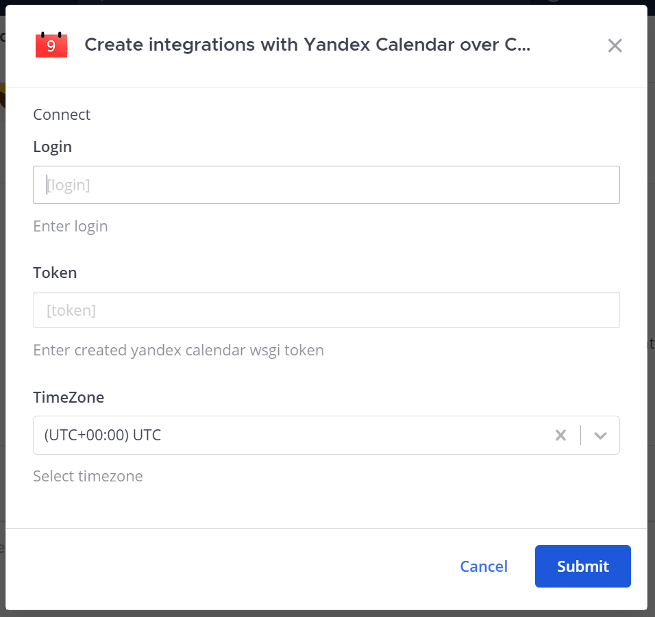

- /yandex-calendar connections profile
  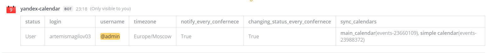

- /yandex-calendar calendars current [--date]
  

- /yandex-calendar connections disconnect
  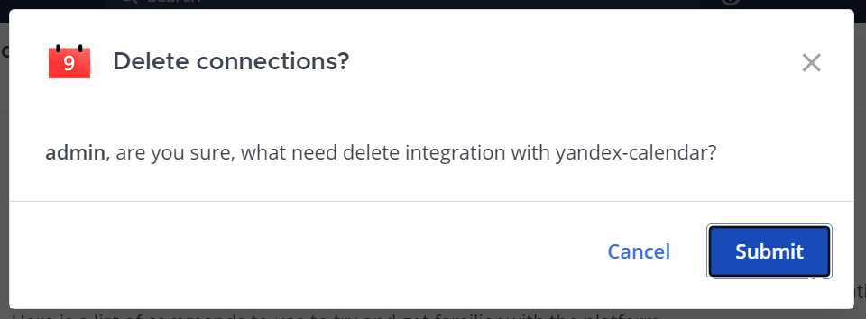

- /yandex-calendar calendars get_a_month <br>
  Снизу будут высвечиваться ошибки клиента и разработчика, в данном случае пользователь __не авторизовался__,
  но пытается получить список конференций за месяц.
  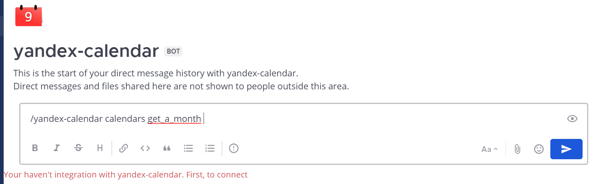

- /yandex-calendar calendars from_to
  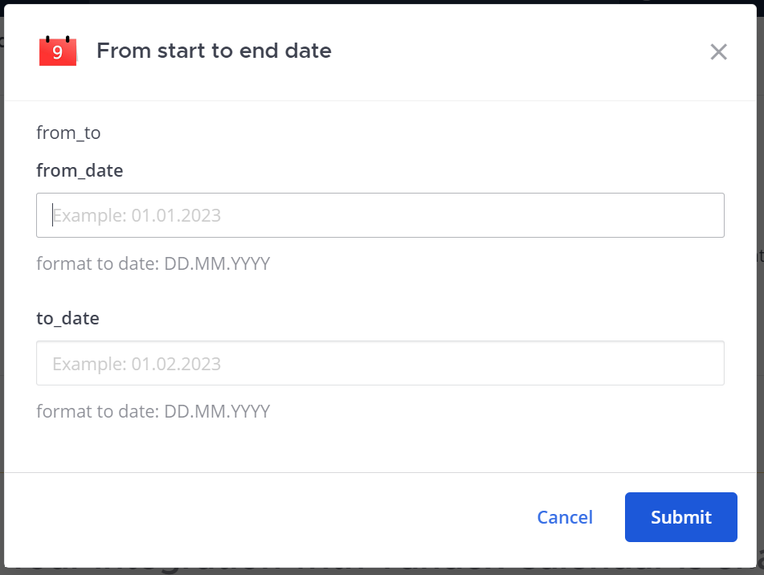

- /yandex-calendar calendars get_a_month <br>
  В модуле `calendars` список конференций в различных интервалах будет в следующей форме
  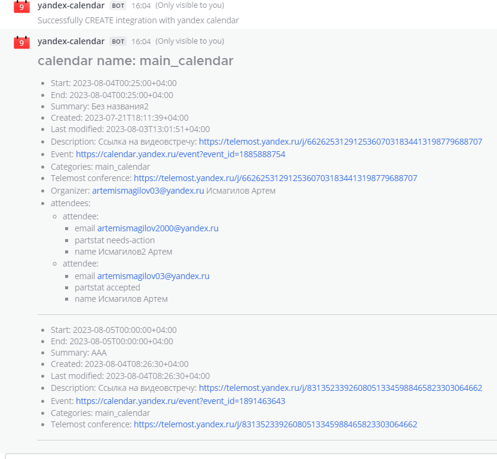

- /yandex-calendar info
  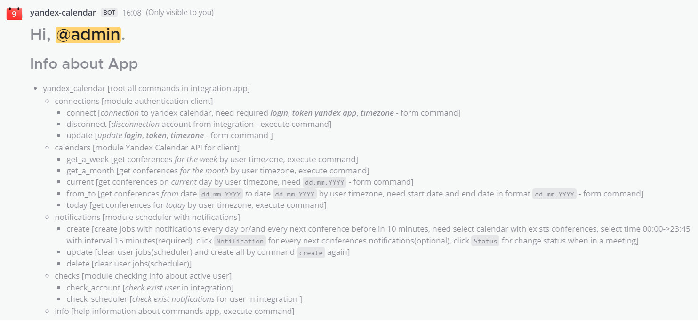

- /yandex-calendar notifications create/update <br>
  Вы можете создать только один планировщик. С помощью `update` можно обновить планировщик,
  задать другие параметры для уведомлений
  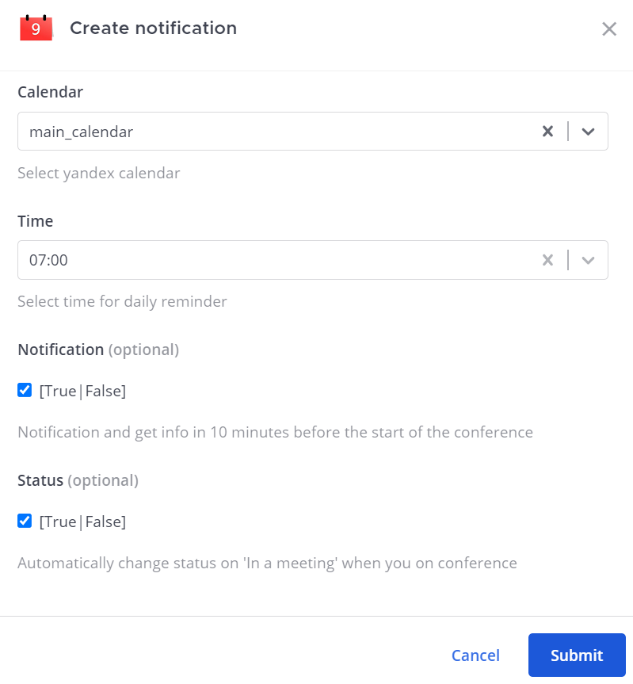

  Ответное сообщение о созданном планировщике
  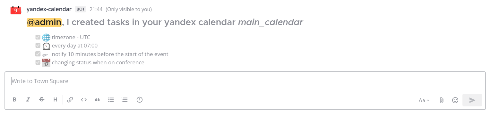

- /yandex-calendar notifications delete <br>
  Попытка удалить несуществующий планировщик
  

- Уведомление (за 10 минут до конференции)/(ежедневное обо всех сегодня конференциях)
  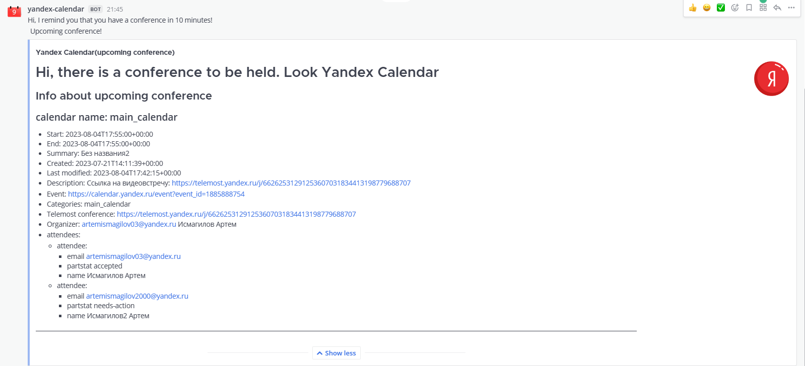

## Алгоритм уведомлений

1. В переменной окружения следует прописать в стиле cron частоту запроса от каждого пользователя,
   который подключить планировщик, к яндекс-серверу<br>
   Примеры https://crontab.guru/examples.html

2. Внимание! Администратору следует тонко настроить время повторения пинга сервера.
   Если запросы слишком регулярные, то приложение будет излишне перегружено, если же редкие, то для сотрудников с
   очень частыми конференциями информация от уведомлений будет не актуальна.

3. Вы получаете уведомление об удалённых/изменённых/добавленных конференций на яндекс-сервере.

4. При тестировании следует поменять несколько параметров, а именно:
    1. поменять в коде функцию уведомление за 1 минуту(поменять 10 на 1)
    2. поменять функцию, которая проверяет существование конференции `в пределах от 15 минут и более` на `в переделах от
       времени сейчас и более`.
    3. поменять параметры создания задач на пинг сервера яндекс календаря с cron стилистики на параметр секунды,
       например пинг каждые 10 секунд, в продакшене этого не стоит делать. Также добавить параметр случайности.
       `jitter ` - исполнение задач в случайное время в заданном порядке секунд
       https://apscheduler.readthedocs.io/en/latest/modules/triggers/cron.html#module-apscheduler.triggers.cron .
       Это обеспечивает стабильность при сильных нагрузках в час пик.

5. Как работает:
    1. Отслеживаются приложением все конференции и при совершении над ними операция приходят уведомления
    2. Приложение уведомляет вас о предстоящей конференции за 10 минут до начал при условии, что конференция была
       добавлена не раньше 15 минут. Почему? Потому что нужно гарантированно отправлять уведомления о событиях которые
       не
       были удалены за 10 минут до сообщения. 5 минут буфер.
    3. Смена статус осуществляется в момент начала конференции и закачивается в момент окончания конференции. Если,
       ваш статус длительнее по времени статуса конференции или стоит в режиме(постоянно), то приложение вернут ваш
       статус.
    4. Блок `notifications` состоит из подпунктов:
        - уведомление ежедневные в конкретное время
        - уведомление обо всех операция связанных с вашими конференциями, синхронизация через лонг-пуллинг,
          зависит от настройки администратора
        - уведомление за 10 минут до начала предстоящей конференции
    5. Примеры:
        - добавленная конференция 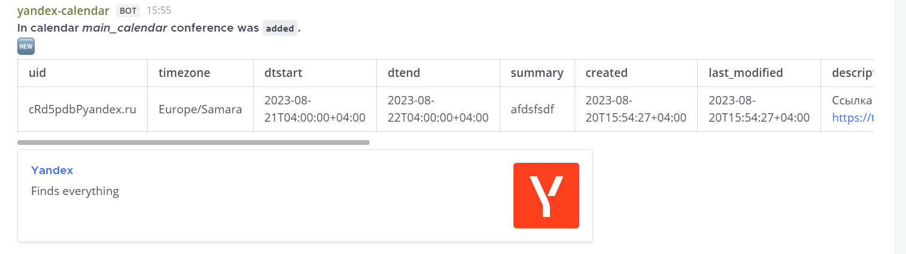
        - измененная конференция 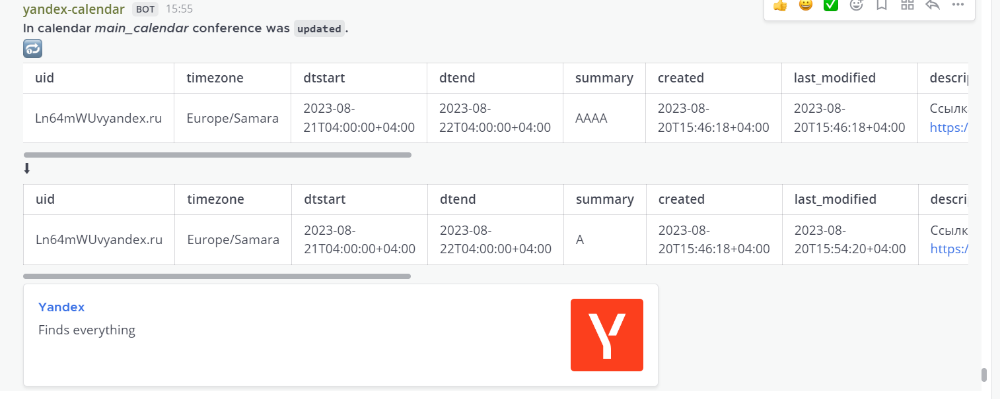
        - удалённая конференция 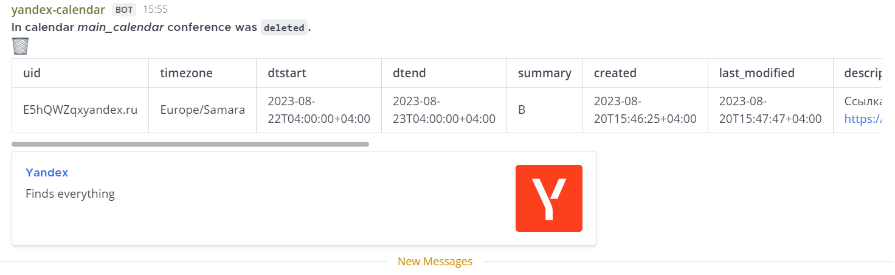

6. Предостережение
    - Если клиент при создании интеграции вводите валидный логин, токен, потом пользуетесь приложением, затем меняете
      в яндекс календаре логин или токен,
      то интеграция сразу удаляет ваши данные из приложения как невалидного пользователя. Следует либо ничего не менять,
      либо в приложении удалять/обновлять данные через команды приложения.
    - Если вы выбираете некоторые календари, а потом удаляете в яндекс календаре, ваш изначальный выбор уведомлений
      с синхронизированными конференциями удаляется как не валидные данные, опять же - обновляйте/удаляте ваши изменения
      через
      команды приложения.
    - Конференции, которые были добавлены раньше 15 минут не будут обрабатываться приложением для обновления статуса и
      сообщения о предстоящем событии, так как невозможно уведомить о предстоящей конференции за 10 минут если вы
      создали
      конференцию за 1, 3, 5 и так далее до 15 минут. 5 минут добавлены как буфер.
    - библиотека apscheduler не корректно работает с несколькими процессами, поэтому в настройках gunicorn не следует 
      запускать более 1 процесса. Существуют обходные пути, которые позволяют работать с несколькими потоками в apscheduler.
        
      > #### https://apscheduler.readthedocs.io/en/latest/faq.html#how-do-i-share-a-single-job-store-among-one-or-more-worker-processes
      > APScheduler does not currently have any interprocess synchronization and signalling scheme that would enable 
      > the scheduler to be notified when a job has been added, modified or removed from a job store.
      > 
      > Workaround: Run the scheduler in a dedicated process and connect to it via some sort of remote access mechanism 
      > like RPyC, gRPC or an HTTP server. The source repository contains an example of a 
      > RPyC based service that is accessed by a client.

## Диаграммы

- __Пинг сервера__ <br>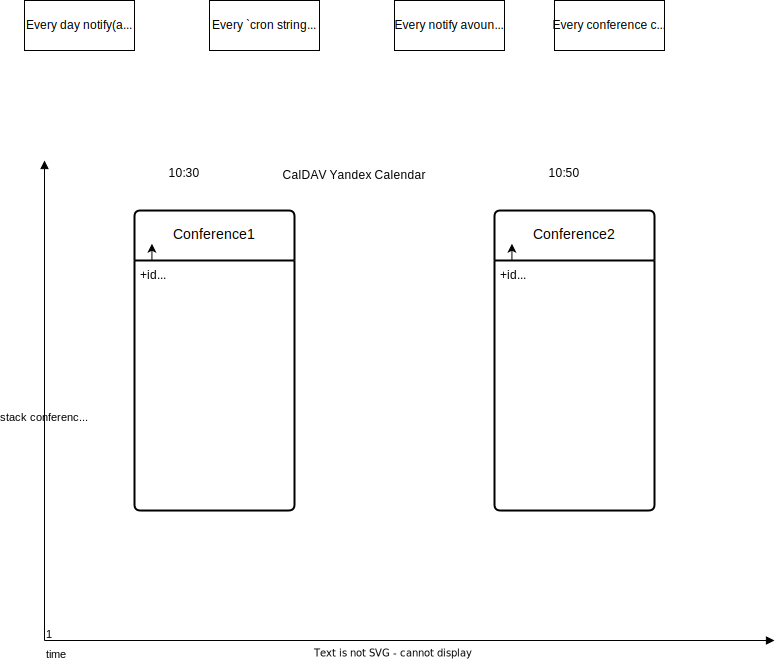
- __БД__ <br>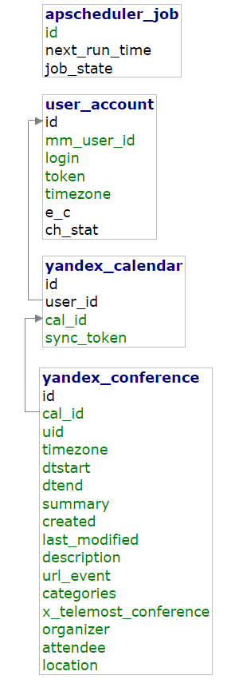
- __apscheduler_job__ <br>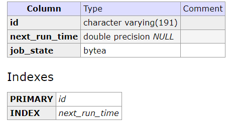
- __user_account__ <br>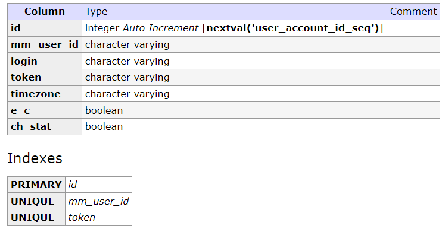
- __yandex_calendar__ <br>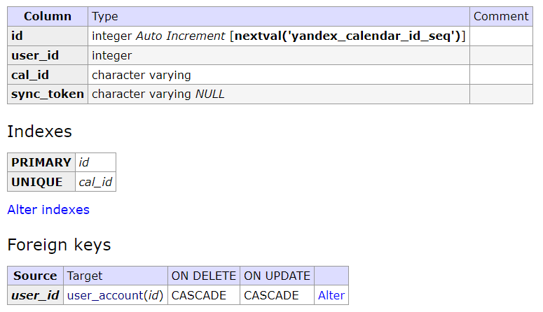
- yandex_conference <br>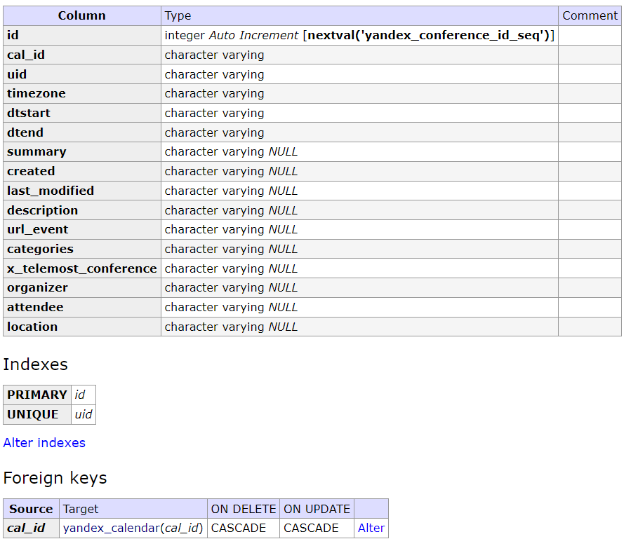

## Полезные ссылки

- Scheduling All Kinds of Recurring Jobs with Python - https://martinheinz.dev/blog/39
- 7 способов выполнения запланированных заданий с помощью Python - https://evogeek.ru/articles/250819/
- Работа с токенами на Flask - https://kirill-sklyarenko.ru/lenta/flask-api-json-web-token-1
- Кодирование секретных ключей -
  https://stackoverflow.com/questions/2490334/simple-way-to-encode-a-string-according-to-a-password
- Настройка работников и потоков в gunicorn - https://stackoverflow.com/questions/38425620/gunicorn-workers-and-threads
- Mattermost Yandex Calendar Plugin (CALDav) - https://github.com/LugaMuga/mattermost-yandex-calendar-plugin
- Команды Postgresql - https://www.postgresqltutorial.com/postgresql-administration/psql-commands/
- Команды SQL - https://www.w3schools.com/sql/default.asp
- Mattermost troubleshooting - https://docs.mattermost.com/install/troubleshooting.html
- Installing
  packages - https://packaging.python.org/en/latest/guides/installing-using-pip-and-virtual-environments/#creating-a-virtual-environment
- RFC2445(iCalendar) - https://www.ietf.org/rfc/rfc2445.txt
- RFC4791(CALDAV) - https://www.ietf.org/rfc/rfc4791.txt
- Python iCalendar - https://github.com/collective/icalendar
- Python CalDAV - https://github.com/python-caldav/caldav
- Add column psql with foreign
  key - https://stackoverflow.com/questions/17645609/add-new-column-with-foreign-key-constraint-in-one-command
- What is a reasonable code coverage % for unit tests (and
  why)? - https://stackoverflow.com/questions/90002/what-is-a-reasonable-code-coverage-for-unit-tests-and-why

## Вопрос-ответ

- Почему не шифруешь токены?

    + Изначально шифровал с помощью библиотеки cryptography через объект Fernet.
      В процессе разработки выяснил, что ни Redmine, ни Mattermost не шифруют токены. Хотя пароли хэшируют - это мы
      одобряем.
      В интернете большая полемика по тому, как правильно шифровать личную информацию. Я склонился к тому, что
      нужно придерживаться политика самого сайта, где рядом создаётся интеграция. Если шифруют, то нужно тоже шифровать
      и наоборот.

    + Давайте посмотрим в как токен храниться в нашей БД.
        * вы должны уже были авторизоваться в интеграции через маттермост(добавить логин, токен, часовой пояс).
        ```bash
        sudo docker exec -it microservice-db-1 bash
        ```
      Вы перешли в оболочку контейнера БД, смотрим содержимое БД
        ```bash
        su postgres
        ```
        ```bash
        psql
        ```
        ```bash
        \dt
        ```
                        List of relations
           Schema |       Name        | Type  |  Owner   
          --------+-------------------+-------+----------
           public | apscheduler_jobs  | table | postgres
           public | user_account      | table | postgres
           public | yandex_calendar   | table | postgres
           public | yandex_conference | table | postgres
          (4 rows)

        ```bash
        SELECT id, token FROM user_account;
        ```

           id |      token         
          ----+----------------------------
            1 | hak3jkeh67y4dd1h6q8r16gqrr 
          (1 row)

    + Токен у нас не зашифрован(мы ничего и не делали для этого), предыдущий метод долгий, лучше просто добавить в
      докер контейнер маттермоста adminer и посмотреть в вебе.
      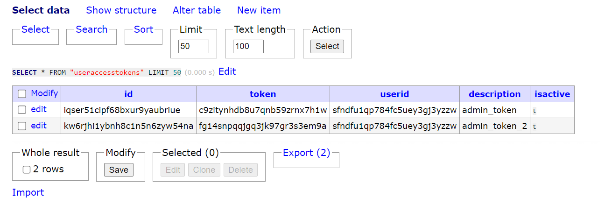

    + В маттермост тоже не зашифрован, такая же ситуация и в редмайне.

    + Почему не шифруем? Если, буквально в двух словах, то REST API токены позволяем использовать совсем малую часть
      функционала приложений. Пароли захешированы, уже хорошо. Если унесут БД все токены можно сразу же поменять.

    + https://docs.mattermost.com/developer/personal-access-tokens.html

- Что мы тестируем?

    + Тесты проверяют правильность работы клиентской части - разделы
        1. */calendars*
        2. */checks*
        3. */connections*
        4. */notifications*
        5. */jobs*
    
## Проблемы Яндекс Календаря

- Отсутствие какой-либо документации, RESTAPI, туториала, инструментария от яндекса для работы с Яндекс-Календарём в
  удобном формате JSON, XML. Google хорошо задокументировал работу с google календарём на python
  https://developers.google.com/calendar/api/quickstart/python?hl=ru
- Выборка текущих конференций происходит по часовому поясу клиента, если вы поменяли часовой пояс, то старые
  конференции не меняют часовой пояс, только на сайте визуально. Поэтому нужно настроить часовой пояс один раз при
  создании клиента интеграции в маттермост.
- Не доступны запросы на занятость (тег freebusy, статус 504).
- Если в яндекс-календаре создаю календари с одинаковым именем, то при добавлении в форму, маттермост удаляет эти
  дубликаты.
  Это и логично, как нам их отличить, если одинаковые имена. Можно сделать выбор по id, но это не самые комфортный
  интерфейс для пользователя.
- Произвольные обновления событий без участия клиента, что требует дополнительной корректировки синхронизации событий.
  Скорее всего, сервер обновляет свойства событий не относящиеся к атрибутам вытягиваемой конференции. Для правильной
  синхронизации потребовалась перепроверка на идентичность новых событий-конференций по sync_token с
  событиями-конфренециями
  в БД.

## Будущие доработки

- добавить русский язык
- оптимизировать алгоритм обновлений конференций через CalDAV сервер
- покрыть код тестами
- выявить уязвимости
- желательна переработка кода

## Благодарности

- Проекту https://github.com/lugamuga/mattermost-yandex-calendar-plugin,
  демонстрирует работу с яндекс календарём, есть документация
  https://pkg.go.dev/github.com/lugamuga/mattermost-yandex-calendar-plugin
- Проекту https://github.com/python-caldav/caldav , очень простые интерфейс-запросы на сервер, вся тяжелейшая работа
  под капотом пакета. Отличная документация, но есть ещё над чем поработать(фильтрация по параметрам). Документация -
  https://caldav.readthedocs.io/en/latest/
- Проекту https://github.com/agronholm/apscheduler . Отличный инструмент для планирования нетривиальных задач,
  триггеров, настройка планировщика и БД. Документация - https://pypi.org/project/APScheduler/
- Проекту [mattermostautodriver](https://github.com/embl-bio-it/python-mattermost-autodriver), форк от заброшенного
  проекта [mattermostdriver](https://github.com/Vaelor/python-mattermost-driver) . На данный момент поддерживается,
  соответствует последним изменения и дополнениям [Mattermost API Reference (4.0.0)](https://api.mattermost.com/).
  Документация https://embl-bio-it.github.io/python-mattermost-autodriver/ . Есть возможность автоматически обновить
  конечные точки
  Mattermost API в пакете
  драйвера https://github.com/embl-bio-it/python-mattermost-autodriver#updating-openapi-specification
  Драйвер не упоминается на сайте Mattermost, однако имеет все шансы быть официальным. Требуется дальнейшая доработка
